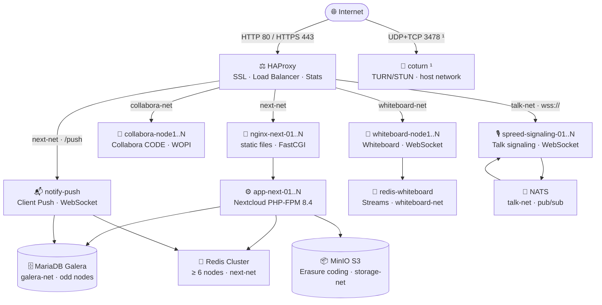

<div align="center">


**High-availability Nextcloud infrastructure — deployable with a single command**

[](https://github.com/oboeglen/Azure-NXT-Maxscale)
[](https://nextcloud.com)
[](https://www.php.net)
[](LICENSE)
[](https://github.com/oboeglen/Azure-NXT-Maxscale/commits/main)

[](https://docs.docker.com/compose/)
[](https://www.haproxy.org)
[](https://mariadb.com/kb/en/galera-cluster/)
[](https://redis.io/docs/management/scaling/)
[](https://min.io)
[](https://www.collaboraonline.com)

[](https://letsencrypt.org)
[](https://www.openssl.org)
[](https://hstspreload.org)
[](https://developer.mozilla.org/en-US/docs/Web/HTTP/CSP)
[](https://securityheaders.com)

*Debian · Ubuntu · RHEL · Rocky Linux · AlmaLinux — x86\_64*

</div>

---

<div align="center">
<table>
<tr>
<td align="center"><br/><sub>Login page</sub></td>
<td align="center"><br/><sub>Dashboard</sub></td>
</tr>
</table>
</div>

---

## 🚧 Coming Soon — Features in Development

> This project is in **active development**. Upcoming features include:

- 🤖 **Local AI** — on-premise language model deployment connected to Nextcloud AI
- ✍️ **Electronic document signing** — eIDAS-compliant signing service integration
- 📝 **Choice between Collabora or OnlyOffice** — office suite selection at deployment time
- 💽 **Classic storage (volumes) as an alternative to S3** — MinIO-free option for simple environments
- 🪨 **Ceph support** — distributed alternative to MinIO for object storage

---

## Table of contents

- [🚀 Quick Start](#-quick-start)
- [⚙️ What deploy.sh does](#️-what-deploysh-does)
- [🏗️ Architecture](#️-architecture)
- [📋 Prerequisites](#-prerequisites)
- [🧩 Deployed services](#-deployed-services)
- [🔧 Nextcloud configuration](#-nextcloud-configuration)
- [🔄 High availability](#-high-availability)
- [💾 MinIO object storage](#-minio-object-storage)
- [🔒 HAProxy security](#-haproxy-security)
- [📝 Collabora CODE](#-collabora-code)
- [🎙️ Nextcloud Talk — HA Signaling](#️-nextcloud-talk--ha-signaling)
- [📬 Client Push (notify\_push)](#-client-push-notify_push)
- [📐 Scaling — adding and removing nodes](#-scaling--adding-and-removing-nodes)
- [🛠️ Common operations](#️-common-operations)
- [🚢 Manual deployment](#-manual-deployment)
- [📊 Performance & sizing](#-performance--sizing)
- [🛡️ Network security recommendations](#️-network-security-recommendations)
- [🐳 Docker images — pinned versions](#-docker-images--pinned-versions)
- [🗄️ Backup](#️-backup)

---

## 🚀 Quick Start

```bash
curl -fsSL https://raw.githubusercontent.com/oboeglen/Azure-NXT-Maxscale/main/deploy.sh \
  -o /tmp/deploy.sh && sudo bash /tmp/deploy.sh
```

The script detects your OS, installs Docker if needed, asks the essential questions, and deploys the full infrastructure. The configuration is saved and reusable on every subsequent run.

---

## ⚙️ What `deploy.sh` does

| Step | Action |
|:-----:|--------|
| ① | RAM check (≥ 16 GB), disk (≥ 50 GB), Docker ≥ 20 |
| ② | OS detection and automatic Docker + Compose installation |
| ③ | Repository clone from GitHub |
| ④ | Interactive prompts — domains, nodes, MinIO disks, certificates |
| ⑤ | Secure secret generation (no `#` character) |
| ⑥ | `.env`, `docker-compose.yml` and Galera config generation |
| ⑦ | DNS check + Let's Encrypt SSL certificates (HTTP-01 / TLS-ALPN-01) |
| ⑧ | Parallel Docker image pull with progress bar |
| ⑨ | Deployment with real-time monitoring and adaptive timeout |
| ⑩ | Health check of all services + credentials display |

**Automatically enforced constraints**

| Component | Constraint | Reason |
|-----------|------------|--------|
| MariaDB Galera | **Odd** number of nodes | Galera quorum (prevents split-brain) |
| Redis Cluster | **Even number ≥ 6** | Masters + replicas (3+3 minimum) |
| MinIO | Tolerance calculated and displayed | Erasure coding EC:N/2 |
| Nextcloud | Waits for Galera to be SYNCED | WSREP check via PHP PDO |

---

## 🏗️ Architecture



> [!NOTE]
> Only HAProxy exposes ports 80 and 443 to the outside. All user files are stored in MinIO. A node failure is **transparent** to the end user.
> ¹ coturn is optional — port 3478 UDP/TCP is only required when coturn is enabled.

**Request flow:**
```
Client → HAProxy (SSL/TLS) → nginx-next-0X → app-next-0X (PHP-FPM :9000)
```

---

## 📋 Prerequisites

| Component | Required |
|-----------|----------|
| Operating system | Debian 11/12/13 · Ubuntu 22.04/24.04 · RHEL / Rocky / AlmaLinux 8/9 |
| Architecture | x86\_64 |
| CPU | 8 cores minimum |
| RAM | 16 GB minimum (32 GB recommended in production) |
| Disk | 500 GB SSD (depending on usage and number of nodes) |
| DNS | 3 subdomains pointing to this server **before** launch |
| Ports | 80 and 443 open for certificate validation |

> [!TIP]
> Docker and Docker Compose are installed automatically if absent.

---

## 🧩 Deployed services

| Service | Role |
|---------|------|
| `haproxy` | Single entry point — reverse proxy, SSL, load balancing |
| `nginx-acme` | ACME challenge validation (Let's Encrypt) |
| `certbot` | Automatic SSL renewal every 12h + 30-day expiry healthcheck |
| `nginx-next-01..N` | Static files + FastCGI proxy to PHP-FPM |
| `app-next-01..N` | Nextcloud application (PHP-FPM) |
| `nextcloud-perms` | Volume permission fix (one-shot) |
| `nextcloud-setup` | Post-installation auto-configuration (one-shot, protected by sentinel) |
| `nextcloud-cron` | Background tasks — `cron.php` every 5 min |
| `mariadb-node1..N` | Replicated database (Galera, bootstrapped via `galera-bootstrap.sh`) |
| `galera-autoheal` | Automatic restart of out-of-sync Galera nodes — `pgrep autoheal` healthcheck |
| `redis-node1..N` | Distributed cache (Redis Cluster) |
| `redis-cluster-init` | Redis cluster initialization (retry on-failure:5) |
| `minio-node1..N` | Distributed S3 object storage (erasure coding) |
| `collabora-node1..N` | Online collaborative office editing — `/hosting/discovery` healthcheck on all nodes |
| `whiteboard-node1..N` | Real-time collaborative whiteboard |
| `redis-whiteboard` | Shared whiteboard state (Redis Streams) |
| `minio-console` *(optional)* | MinIO web console — accessible via `/s3-console` |
| `notify-push` | Client Push — real-time sync notifications over WebSocket (`/push`) |
| `nats` *(Talk only)* | NATS message broker — distributes signaling events across spreed-signaling nodes |
| `spreed-signaling-01..N` *(Talk only)* | WebSocket signaling server — HAProxy load-balances across all nodes |
| `coturn` *(Talk, optional)* | TURN/STUN relay — media relay for clients behind NAT or strict firewalls |

> MinIO bucket versioning is automatically enabled by `deploy.sh` at the end of the Nextcloud installation, via `minio/mc:latest` (image pulled at deployment but without a persistent container).

**Exposed ports:** `80` (HTTPS redirect) · `443` (Nextcloud, Collabora, Whiteboard, Talk, Push) · `3478/udp+tcp` (coturn TURN/STUN — only when coturn is enabled)

> [!CAUTION]
> HAProxy stats (`/stats`) and the MinIO console (`/s3-console`) are diagnostic tools that can be enabled during deployment. Both pages require credentials, but they remain exposed on Nextcloud's public URL and reveal sensitive infrastructure information. Reserve for test environments or disable after use.

---

## 🔧 Nextcloud configuration

Everything is applied automatically by `nextcloud-setup` on first startup.

### Integrations

- **Redis Cluster** — distributed cache, sessions and file locking
- **Collabora Online** — office editing (Writer, Calc, Impress)
- **Whiteboard** — real-time collaborative whiteboard
- **MinIO S3** — object storage for all user files
- **Nextcloud Talk** — HA signaling via spreed-signaling + NATS; optional coturn TURN relay
- **Client Push (notify_push)** — real-time desktop/mobile sync notifications over WebSocket
- `trusted_proxies` + `forwarded_for_headers` — real client IPs forwarded behind HAProxy

### Security & UX

- Web updates disabled (`upgrade.disable-web = true`)
- Sign-up link hidden on the login page
- Empty skeleton folder — no example files created for new accounts
- `allow_local_remote_servers` and `overwriteprotocol` defined in `nextcloud-custom.config.php`, mounted `:ro` in all containers — fixes `.well-known/caldav` and enforces permanent HTTPS

### Performance

- System cron via `nextcloud-cron` — `cron.php` every 5 minutes — `/proc/1/cmdline` healthcheck
- OPcache enabled with `validate_timestamps=0` (PHP reload required to pick up file updates)
- Previews limited to 2,048 px, lightweight formats only (video and Office disabled)
- Automatic log rotation at 100 MB
- `db:convert-filecache-bigint` applied during initial maintenance

### Disabled apps at installation

> `AppAPI` · `First Run Wizard` · `Nextcloud Announcements` · `Privacy` · `Support` · `Usage Survey` · `Related Resources` · `Recommendations`

---

## 🔄 High availability

| Component | Tolerance | Behavior during failure |
|-----------|:---------:|------------------------|
| 🔀 Nextcloud FPM | ✅ Automatic | No impact — HAProxy redistributes in < 10 s |
| 🗄️ MariaDB Galera | ✅ Automatic | No impact — quorum maintained, `galera-autoheal` restarts out-of-sync nodes |
| 🔴 Redis Cluster | ✅ Automatic | No impact — cluster tolerates 1 failure per hash slot |
| 📦 MinIO | ✅ Automatic | Reads continue, writes restored as soon as the node returns |
| 📝 Collabora | ✅ Automatic | Editing session lost, automatic reconnection |
| 🎨 Whiteboard | ✅ Automatic | Automatic WebSocket reconnection (state persisted in Redis) |
| 🎙️ spreed-signaling | ✅ Automatic | HAProxy removes the failing node — active calls may reconnect once |
| 📬 notify-push | ✅ Automatic | Container restarts automatically; clients reconnect the WebSocket |
| 📨 NATS | ⚠️ Single node | Service interruption until the container restarts (`restart: always`) |
| 🔄 coturn | ⚠️ Single node | Falls back to STUN-only — peer-to-peer if NAT allows, otherwise media blocked |

### Full Galera cluster restart

`galera-bootstrap.sh` automatically detects which node to bootstrap:

- **First start** — no `grastate.dat` → bootstrap from node1
- **Clean shutdown** — `safe_to_bootstrap: 1` → bootstrap from the last node to shut down
- **Crash / hot restart** — `safe_to_bootstrap: 0` → node1 joins the existing cluster without creating a new one (prevents split-brain)

To force a manual bootstrap after a complete hard shutdown of all nodes:
```bash
# Identify the most advanced node (highest seqno)
for i in 1 2 3; do echo "node$i:"; docker run --rm -v maxscale_mariadb_n${i}_data:/data alpine grep -E "seqno|safe" /data/grastate.dat; done
# Fix safe_to_bootstrap on that node, then restart
```

---

## 💾 MinIO object storage

MinIO runs in **distributed erasure coding** mode — N nodes × D drives per node.

| Configuration | Read tolerance | Write tolerance |
|---|---|---|
| 4 nodes × 2 drives (8 drives total) | Loss of 4 drives | Loss of 3 drives |
| 4 nodes × 4 drives (16 drives total) | Loss of 8 drives | Loss of 7 drives |

**Test mode (single-server)** — all paths on the same physical disk (`/data/minio/...`). Automatically offered by `deploy.sh`. Use only for development.

**Production mode** — each `DATA{N}` must point to a **separate physical disk** for erasure coding to be truly effective.

### Disk Wizard

`deploy.sh` includes an interactive disk preparation wizard that runs automatically when you answer **"No"** to test mode. It scans the server's available block devices and lets you format and mount them one by one before configuring MinIO paths.

```
┌─────────────────────────────────────────────────────────────────┐
│  Available disks                                                │
├────────────────┬────────┬────────┬───────────────┬─────────────┤
│ Device         │ Size   │ FS     │ Mount         │ Model       │
├────────────────┼────────┼────────┼───────────────┼─────────────┤
│ /dev/sda       │ 500G   │ ext4   │ /             │ Samsung SSD │
│ /dev/sdb       │ 2T     │        │               │ WDC WD20    │
│ /dev/sdc       │ 2T     │        │               │ WDC WD20    │
└────────────────┴────────┴────────┴───────────────┴─────────────┘
```

For each unformatted disk you select, the wizard:

1. **Formats** the disk as XFS with optimized parameters:
   - Log size scaled to disk capacity (`lazy-count=1` for faster metadata)
   - Allocation group count (`agcount`) tuned for parallelism on disks ≥ 10 GB
2. **Mounts** the disk to a path of your choice (default: `/data/minio/node{N}/data{N}`)
3. **Adds a persistent fstab entry** so the mount survives reboots
4. **Refreshes the disk table** so the updated filesystem and mount point are visible immediately

The wizard then uses the confirmed mount paths as MinIO `DATA{N}` paths in `docker-compose.yml`.

> [!TIP]
> The wizard only proposes disks that are not already mounted to critical paths (e.g., `/`, `/boot`). It displays the disk model and current filesystem so you can identify the right devices before formatting.

### Cluster inspection

```bash
source /opt/nxt-maxscale/.env
docker run --rm --network storage-net --entrypoint sh minio/mc -c "
  mc alias set r http://minio-node1:9000 ${MINIO_ACCESS_KEY} ${MINIO_SECRET_KEY} --quiet
  mc admin info r
"
```

### Repair after node failure

```bash
source /opt/nxt-maxscale/.env
docker run --rm --network storage-net --entrypoint sh minio/mc -c "
  mc alias set r http://minio-node1:9000 ${MINIO_ACCESS_KEY} ${MINIO_SECRET_KEY} --quiet
  mc admin heal -r r/nextcloud
"
```

### MinIO web console (optional)

> [!WARNING]
> The console is protected by MinIO credentials (`MINIO_ACCESS_KEY` / `MINIO_SECRET_KEY`), but it is exposed on Nextcloud's public URL without IP restriction or additional network layer. It provides direct access to all MinIO buckets. Use only in test or diagnostic environments, and disable afterwards.

Enabled during deployment by `deploy.sh` (same principle as HAProxy stats on `/stats`). Once enabled, the console is accessible from the browser without exposing an additional port.

| | |
|---|---|
| **URL** | `https://<NEXTCLOUD_DOMAIN>/s3-console/login` |
| **Login** | MinIO access key (`MINIO_ACCESS_KEY`) |
| **Password** | MinIO secret key (`MINIO_SECRET_KEY`) |
| **Image** | [`ghcr.io/georgmangold/console`](https://github.com/georgmangold/console) |

HAProxy routes `/s3-console/*` to the `minio-console:9090` container **stripping the `/s3-console` prefix** before forwarding to the Go server, which prevents MIME errors on the React SPA's static assets. The `/s3-console` and `/s3-console/` roots are automatically redirected to `/s3-console/login`.

> [!TIP]
> To enable or disable the console on an existing deployment, re-run `deploy.sh` — the answer is saved in the configuration file and reused on each run.

---

## 🔒 HAProxy security

### HAProxy stats (optional)

> [!WARNING]
> Stats (`/stats`) are protected by a dedicated password (`HAPROXY_STATS_PASSWORD`), but remain exposed on Nextcloud's public URL. They reveal the internal infrastructure topology (container names, backend states, network metrics). Reserve for test environments or disable after use.

Enabled during deployment by `deploy.sh`. Accessible at `https://<NEXTCLOUD_DOMAIN>/stats` with credentials set during installation (`HAPROXY_STATS_PASSWORD`).

### TLS

- TLS 1.2 minimum, **TLS 1.3 preferred**
- Modern suites only — ECDHE + AES-GCM + CHACHA20
- `no-tls-tickets` — persistent forward secrecy (Perfect Forward Secrecy)

### HTTP headers

| Header | Value |
|--------|-------|
| `Strict-Transport-Security` | 2 years · `includeSubDomains` · `preload` |
| `X-Content-Type-Options` | `nosniff` |
| `X-XSS-Protection` | `1; mode=block` |
| `Referrer-Policy` | `strict-origin-when-cross-origin` |
| `X-Frame-Options` | `SAMEORIGIN` (Nextcloud only) |
| `Permissions-Policy` | `camera=(self)` · `microphone=(self)` · `geolocation=(self)` · `payment=()` |
| `Server`, `X-Powered-By` | Removed |

> `camera`, `microphone` and `geolocation` are allowed on `(self)` for Nextcloud Talk and geolocation applications.

### Request filtering

- **Anti-Slowloris** — request dropped if not fully received within 10 s
- **Dangerous methods** blocked — `TRACE`, `DEBUG`, `CONNECT`
- **WebDAV methods** restricted to API paths (`/remote.php`, `/public.php`, `/ocs`) — `OPTIONS` free for CORS preflight
- **Scanner user-agents** blocked — sqlmap, nikto, nmap, masscan, zgrab
- **Common scan paths** blocked (403) — `/wp-admin`, `/wp-login`, `/.git`, `/.env`, `/phpmyadmin`, `/xmlrpc.php`, `/cgi-bin`…
- **Collabora admin console** blocked (403) — `/browser/dist/admin` inaccessible from outside
- **Health check logs silenced** — `/status.php`, `/robots.txt`, `/favicon.ico` do not appear in HAProxy logs (~80% noise reduction)
- **Extended CSP** — WebSocket allowed to Collabora and Whiteboard (`wss://`)

### Monitoring (/stats page)

The HAProxy statistics page displays the real-time status of **all** backends:

| Block | Content |
|-------|---------|
| `nextcloud` | nginx-next-01..N nodes (HTTP :80) |
| `nextcloud-fpm` | app-next-01..N nodes (FPM TCP :9000) — monitoring only |
| `coolwsd` | Collabora nodes (WOPI :9980) |
| `whiteboard` | Whiteboard nodes (WS :3002) |
| `signaling` | spreed-signaling nodes (WS :8080) — Talk only |
| `notify-push` | notify-push container (:7867) — Client Push |
| `galera` | MariaDB nodes (:3306) |
| `minio` | MinIO S3 nodes (:9000) |
| `redis-cluster` | Redis nodes (:6379) |

---

## 📝 Collabora CODE

### home_mode — limit removed

Collabora is deployed in **`home_mode`** (`--o:home_mode.enable=true`), which disables the splash screen and user feedback popup.

By default, `home_mode` caps each node at 20 connections and 10 simultaneous documents. **`deploy.sh` automatically removes this limit** via a binary patch of the `coolwsd` process applied after container startup. The binary is replaced on the container's disk (`docker cp` + `docker restart`) — `extra_params` and YAML configuration are not touched.

| Nodes | Connections | Documents |
|:-----:|:-----------:|:---------:|
| 1 | ∞ | ∞ |
| N | ∞ | ∞ |

The patch tries three strategies in order: ① exact known byte sequence, ② `mov r32,20 + mov r32,10` pair followed by a `TEST`/`CMP` within the next 24 bytes (all x86-64 registers tested), ③ anchor on the `home_mode.enable` string to locate adjacent code. Both immediates found are replaced with `INT_MAX (2,147,483,647)`. If no strategy matches, the patch is skipped with a warning — the stack remains functional with the original limits.

### Patch persistence after restart

The patch is written to the container's write layer (`docker cp`). Behavior by scenario:

| Scenario | Patch retained? |
|---|:---:|
| Crash + automatic restart (`restart: always`) | ✅ |
| `docker restart collabora-nodeX` | ✅ |
| `docker compose up -d` (unchanged container) | ✅ |
| Update via `deploy.sh` (quick update mode) | ✅ |
| `docker compose up -d --force-recreate` | ❌ |
| `docker compose down` + `docker compose up -d` | ❌ |
| Manual update (`docker pull` + `docker compose up -d` outside `deploy.sh`) | ❌ |

`deploy.sh` automatically reapplies the patch in all cases: initial deployment and quick update mode (pull + recreate images). A manual `docker compose up -d` outside `deploy.sh` restores the original binary without warning.

### Security

- **Administration console** (`/browser/dist/admin/admin.html`) blocked by HAProxy → HTTP 403
- **Document size limit** — 100 MB maximum per open document (`--o:net.max_file_size=104857600`), configurable in `extra_params`
- **SSL terminated by HAProxy** — Collabora receives plain HTTP internally (`ssl.enable=false`, `ssl.termination=true`)

---

## 🎙️ Nextcloud Talk — HA Signaling

A dedicated signaling server (`spreed-signaling`) is required so that Talk calls work correctly when users are served by different Nextcloud FPM nodes. Without it, WebRTC session negotiation fails across nodes.

### Components

| Container | Role |
|-----------|------|
| `spreed-signaling-01..N` | WebSocket signaling — HAProxy `leastconn` distributes long-lived connections across all nodes |
| `nats` | Message broker — routes signaling events between nodes so any two clients can communicate regardless of which node they landed on |
| `coturn` *(optional)* | TURN/STUN relay — required when clients are behind symmetric NAT or strict corporate firewalls |

### High availability

| Component | Tolerance | Behavior during failure |
|-----------|:---------:|------------------------|
| 🎙️ spreed-signaling | ✅ Automatic | HAProxy removes the failing node — active calls may drop once then reconnect |
| 📨 NATS | ⚠️ Single node | Service interruption until the container restarts (`restart: always`) |
| 🔄 coturn | ⚠️ Single node | Falls back to STUN-only — peer-to-peer if NAT allows, otherwise media blocked |

### STUN / TURN

| Scenario | Configuration |
|----------|--------------|
| coturn **disabled** | Nextcloud uses `stun.nextcloud.com:443` — peer-to-peer if NAT allows, no firewall changes needed |
| coturn **enabled** | Full TURN relay on `TALK_DOMAIN:3478/udp` and `:3478/tcp` — works behind any NAT type |

> [!IMPORTANT]
> coturn uses `network_mode: host` — it requires a **Linux VPS** (not macOS Docker Desktop or WSL2). Open ports `3478/udp` and `3478/tcp` in your firewall when coturn is enabled.

### Secrets and registration

`deploy.sh` handles all secret wiring automatically:

1. Generates `GEN_TALK_SECRET` and stores it in `.env`
2. Writes it into `signaling.conf` under the `[nc]` section (`urls` + `secret` keys)
3. Registers it in Nextcloud via `occ talk:signaling:add "wss://TALK_DOMAIN/" <secret> --verify`
4. Configures STUN/TURN via `occ talk:stun:add` / `occ talk:turn:add` when coturn is enabled

> [!TIP]
> To inspect the registered signaling servers:
> ```bash
> docker exec -u www-data app-next-01 php /var/www/html/occ talk:signaling:list
> ```

---

## 📬 Client Push (notify_push)

Client Push replaces polling with a persistent WebSocket connection, so file changes appear immediately in Nextcloud desktop and mobile clients — no more 30-second sync delays.

### How it works

```
Nextcloud FPM ──► notify-push:7867 ──► WebSocket clients (desktop / mobile)
                       ▲
              HAProxy: /push path (intercepted before the general Nextcloud rule)
```

The `notify-push` container runs the `notify_push` binary bundled inside the Nextcloud image. It reads `config.php` directly to connect to the same MariaDB cluster and Redis cluster as the FPM nodes — no additional credentials or configuration required.

### Configuration

Automatic — `deploy.sh` runs `occ notify_push:setup "https://NEXTCLOUD_DOMAIN/push"` after deployment, which:
1. Registers the push endpoint with Nextcloud
2. Runs `occ notify_push:self-test` to validate all 6 checks: Redis, database, Nextcloud connectivity, trusted proxy, push endpoint trust, and version compatibility

> [!NOTE]
> HAProxy uses a TCP-only health check for `notify-push` — `notify_push` exposes no unauthenticated HTTP endpoint suitable for `httpchk`. The container itself runs a `curl` health check against `/test/cookie`.

---

## 📐 Scaling — adding and removing nodes

When a stack is already deployed, re-running `deploy.sh` presents a three-option menu:

```
[1] Quick update        — pull images + restart
[2] Scale up / down nodes
[3] Full deployment     — start from scratch
```

**Scaling** mode modifies the number of nodes per service **without data loss** — Docker volumes are never deleted, `.env` is not regenerated.

### Behavior by service

| Service | Scale-up | Scale-down | Notes |
|---------|:--------:|:----------:|-------|
| **Nextcloud FPM + nginx** | ✅ | ✅ | FPM+nginx pairs added or removed together |
| **MariaDB Galera** | ✅ | ✅ | Odd count required — automatic SST on addition |
| **Redis Cluster** | ✅ | ✅ | Even delta mandatory — automatic cluster integration |
| **Collabora CODE** | ✅ | ✅ | `home_mode` binary patch reapplied on new nodes |
| **Whiteboard** | ✅ | ✅ | |
| **MinIO** | ✅ | ❌ | Scale-up via pool expansion; scale-down via `mc admin decommission` |

### Internal mechanics

**Nextcloud / Galera / Collabora / Whiteboard** — `docker compose up -d --remove-orphans` creates new containers and removes orphans. HAProxy is restarted to register the new backends.

**Redis Cluster (scale-up)**
1. Wait for new nodes to respond to `PING`
2. `--cluster add-node` for each master
3. `cluster myid` to retrieve the master ID, then `--cluster add-node --cluster-slave` for the replica
4. `--cluster fix` to resolve any open migration slots
5. `--cluster rebalance --cluster-use-empty-masters` to equalize slots

**Redis Cluster (scale-down)**
1. Slots from the master to be removed are resharded to another master (`--cluster reshard`)
2. `--cluster del-node` for the replica then the master
3. `--cluster fix` + `--cluster rebalance` to rebalance remaining slots

**MinIO (scale-up)**
- New node paths are collected interactively (default: `/data/minio/nodeN/dataN`)
- The new pool is registered in `.minio-pools` (`start:end` per line)
- `gen_compose` rebuilds the `server` command with all pools: `server pool1 pool2 ...`
- All MinIO nodes restart with the new command (~30 s downtime, data preserved)

### Constraints

| Constraint | Detail |
|-----------|--------|
| Redis — even delta | Each batch = 1 master + 1 replica |
| Redis — minimum 6 | 3 masters + 3 replicas minimum |
| Galera — odd count | Quorum required |
| MinIO — scale-down | Not supported — decommission via `mc admin decommission start` |
| Passwords | Never regenerated during scaling — `.env` is preserved |

### Persistence across reboots

Scaling configuration is stored in:

| File | Content | Persistence |
|------|---------|:-----------:|
| `.env` | Passwords, MinIO paths, MINIO_MODE, MINIO_BYPASS | ✅ Permanent |
| `.minio-pools` | MinIO pool history | ✅ Permanent |
| `/tmp/.nxt-maxscale-config.env` | deploy.sh answer cache | ❌ Lost on reboot |

If the `/tmp/` cache is absent, `deploy.sh` automatically rebuilds the configuration from `.env` and the state of running containers.

---

## 🛠️ Common operations

### Check Galera cluster status

```bash
source /opt/nxt-maxscale/.env
docker exec mariadb-node1 mariadb -uroot -p"${MARIADB_ROOT_PASSWORD}" \
  -e "SHOW GLOBAL STATUS LIKE 'wsrep_%';" 2>/dev/null \
  | grep -E 'cluster_size|cluster_status|ready|connected|state_comment|flow_control_paused'
```

### Bootstrap Galera after total failure

```bash
# 1. Start the bootstrap node
docker compose up -d mariadb-node1

# 2. Once node1 is healthy, start the others in parallel (automatic IST/SST)
docker compose up -d mariadb-node2 mariadb-node3 # ... up to mariadb-nodeN
```

> After full synchronization, edit `mariadb/galera-node1.cnf` and replace `gcomm://` with `gcomm://mariadb-node1,mariadb-node2,...,mariadb-nodeN`, then restart node1.

### SSL renewal

The certificate is automatically renewed by `certbot` every 12h. To force manually:

```bash
docker compose exec certbot certbot renew --webroot -w /var/www/certbot
docker compose restart haproxy
```

### Re-run post-installation configuration

```bash
docker compose rm -f nextcloud-setup && docker compose up -d nextcloud-setup
```

### Check Nextcloud logs

```bash
docker exec -u www-data app-next-01 php /var/www/html/occ log:tail --lines=50
```

---

## 🚢 Manual deployment

<details>
<summary>Show detailed steps</summary>

### 1. Clone the repository

```bash
git clone https://github.com/oboeglen/Azure-NXT-Maxscale.git
cd Azure-NXT-Maxscale
```

### 2. Configure the environment

```bash
cp .env.example .env
nano .env   # Fill in ALL values
```

### 3. Generate SSL certificates

> DNS must point to this server before this step.

```bash
source .env
docker run --rm -p 80:80 \
  -v "maxscale_letsencrypt:/etc/letsencrypt" \
  certbot/certbot certonly --standalone --agree-tos --no-eff-email \
  --email "${CERTBOT_EMAIL}" \
  -d "${NEXTCLOUD_DOMAIN}" -d "${COLLABORA_DOMAIN}" -d "${WHITEBOARD_DOMAIN}" \
  --cert-name stack

mkdir -p certs
docker run --rm \
  -v "maxscale_letsencrypt:/etc/letsencrypt:ro" \
  -v "$(pwd)/certs:/certs" \
  alpine sh -c "cat /etc/letsencrypt/live/stack/fullchain.pem \
    /etc/letsencrypt/live/stack/privkey.pem > /certs/stack.pem && chmod 600 /certs/stack.pem"
```

### 4. Create MinIO directories

```bash
for node in 1 2 3 4; do
  for disk in 1 2 3 4; do
    path=$(grep "^MINIO_NODE${node}_DATA${disk}=" .env | cut -d= -f2)
    mkdir -p "${path}"
  done
done
```

### 5. Start the infrastructure

```bash
docker compose up -d
docker compose logs -f nextcloud-setup
```

</details>

---

## 📊 Performance & sizing

Two test series cover the platform: **raw HTTP microbenchmarks** (pure throughput on `/status.php` and `/login`) and **k6 realistic load tests** simulating active users across four business scenarios.

---

### Raw HTTP microbenchmarks — 6 FPM config (reference)

> Measurements taken on **6 FPM · 5 Galera · 6 Redis · 4 MinIO · 3 Collabora · 3 Whiteboard**, from the server itself via HAProxy/TLS.

| Endpoint | Concurrency | Throughput | Average | P95 | P99 | Errors |
|---|:-:|:-:|:-:|:-:|:-:|:-:|
| `/status.php` | 20 | **120 req/s** | 156 ms | 365 ms | 388 ms | 0 / 200 |
| `/login` | 20 | **44 req/s** | 432 ms | 697 ms | 862 ms | 0 / 200 |
| `/status.php` stress | 50 | **247 req/s** | 192 ms | 299 ms | 375 ms | 0 / 500 |
| `/status.php` stress | 100 | **242 req/s** | 369 ms | 494 ms | 522 ms | 0 / 500 |
| `/login` stress | 50 | **60 req/s** | 783 ms | 1,061 ms | 1,154 ms | 0 / 300 |
| Maximum stress | 150 | **231 req/s** | 580 ms | 959 ms | 1,059 ms | 0 / 600 |

**0 network errors** across 1,900 requests. The system holds at 150 simultaneous connections without failure.

---

### k6 realistic load tests — user scenarios

The two tests below were launched **from the server itself** (k6 locally): TLS network latency is near zero. In real usage, add ~50–150 ms depending on client geography.

> A VU (Virtual User) simulates a **concurrent session** with realistic think times (10–30 s between requests). The ~1,450 users of a 3 FPM config are never all connected simultaneously: the concurrency peak represents ~5–10% of active users, i.e. ~24 concurrent sessions — **1 VU ≈ 15 DAU**. Server load depends on concurrent requests, not the number of distinct accounts.

#### Test A — SME configuration, nominal load (k6 v0.55)

Config: **6 FPM · 5 Galera · 6 Redis · 4 MinIO · 3 Collabora · 3 Whiteboard** · 7.6 GB RAM VPS

| Parameter | Value |
|-----------|-------|
| VUs peak | **34** (20 WebDAV · 8 browser · 4 Collabora · 2 Whiteboard) |
| Test accounts | 25 (`pme_user_01..25`) |
| Complete iterations | 980 in 8m30s — 7.68 req/s average |

| Scenario | avg | p(50) | p(90) | **p(95)** | p(99) | SLA | Status |
|---|---:|---:|---:|---:|---:|:---:|:---:|
| Browser sessions | 74 ms | 68 ms | 123 ms | **155 ms** | 243 ms | < 4 s | ✅ |
| WebDAV sync | 862 ms | 689 ms | 1,680 ms | **1,980 ms** | 2,660 ms | < 3 s | ✅ |
| Collabora WOPI | 959 ms | 864 ms | 1,920 ms | **2,160 ms** | 3,010 ms | < 5 s | ✅ |
| Whiteboard | 904 ms | 930 ms | 1,770 ms | **2,060 ms** | 2,720 ms | < 5 s | ✅ |
| Login (info) | 167 ms | 149 ms | 244 ms | 303 ms | 444 ms | — | — |
| File upload (info) | 449 ms | 392 ms | 694 ms | 764 ms | 1,070 ms | — | — |

| Metric | Value |
|--------|-------|
| HTTP 5xx errors | **0** |
| Container crashes | **0** |
| `http_req_failed` | 0.97% (38 / 3,911) — timeouts + TLS resets |
| Data received | 45 MB · 88 kB/s |

**All SLAs pass.** The 6 FPM SME configuration handles the peak without server errors or crashes on an undersized 7.6 GB RAM VPS.

---

#### Test B — Small team configuration, saturation load (k6 v2.0.0) — 2026-05-27

Config: **3 FPM · 3 Galera · 6 Redis · 4 MinIO · 3 Collabora · 1 Whiteboard** · 7.6 GB RAM VPS

> The 3 FPM configuration is sized for ~1,450 users (nominal peak ~24 VUs). This test intentionally pushes to **60 VUs — 2.5× nominal capacity** — to measure saturation behavior.

| Parameter | Value |
|-----------|-------|
| VUs peak | **60** (30 WebDAV · 15 browser · 10 Collabora · 5 Whiteboard) |
| Test accounts | 50 (`pme_user_01..50`) |
| Complete iterations | 654 in 8m26s — 5.69 req/s average |

| Scenario | avg | p(50) | p(90) | **p(95)** | p(99) | SLA | Status |
|---|---:|---:|---:|---:|---:|:---:|:---:|
| Browser sessions | 927 ms | 770 ms | 2,247 ms | **2,868 ms** | 3,794 ms | < 4 s | ✅ |
| WebDAV sync | 1,201 ms | 731 ms | 3,000 ms | **4,285 ms** | 5,822 ms | < 3 s | ⚠️ |
| Collabora WOPI | 836 ms | 533 ms | 2,378 ms | **3,089 ms** | 3,753 ms | < 5 s | ✅ |
| Whiteboard | 2,104 ms | 1,774 ms | 4,071 ms | **4,900 ms** | 6,015 ms | < 5 s | ✅ |

> ⚠️ WebDAV p95 exceeds 3 s at 2.5× nominal capacity — expected behavior. At nominal load (≤ 24 VUs), the SLA is met in accordance with the model.

| Metric | Value |
|--------|-------|
| HTTP 5xx errors | **0** |
| Container crashes | **0** |
| Real network errors (broken pipe WebDAV) | **0.07%** (2 / 2,881) |
| Declared `http_req_failed` | 5.13% — of which 146 HTTP 404 on `richdocuments/checkSettings` (endpoint not exposed in this deployment) |
| Successful application checks | **99.92%** (2,728 / 2,730) |
| Data received | 39 MB · 78 kB/s |

**0 server errors, 0 crashes.** The 3 FPM configuration absorbs 2.5× its nominal load with graceful degradation: browser, Collabora and Whiteboard remain within SLA; WebDAV alone exceeds in p95 under extreme overload.

---

### A vs B comparison

> ⚠️ The two tests are **not comparable at iso-load**: test B uses 76% more VUs (+26 VUs) and half the FPM nodes. The degradation reflects both combined effects — not FPM reduction alone.

| Criterion | Test A — 6 FPM · 34 VUs | Test B — 3 FPM · 60 VUs |
|-----------|:-----------------------:|:-----------------------:|
| FPM / nominal load | 6 nodes (~2,450 users) | 3 nodes (~1,450 users) |
| Injected VUs | 34 (nominal load) | 60 (**2.5× 3 FPM threshold**) |
| Browser sessions p95 | **155 ms** | 2,868 ms |
| WebDAV p95 | **1,980 ms** ✅ | 4,285 ms ⚠️ |
| Collabora p95 | **2,160 ms** ✅ | 3,089 ms ✅ |
| Whiteboard p95 | **2,060 ms** ✅ | 4,900 ms ✅ |
| HTTP 5xx errors | **0** | **0** |
| Container crashes | **0** | **0** |
| Network errors | 0.97% | 0.07% |

Degradation is **consistent with the model** and **graceful**: no crashes, no server errors, even under saturation.

---

### FPM node count simulation

> Model based on real measurements (★ Test A, ▲ Test B extrapolated to nominal load). Decreasing yield of **88% per node** due to shared resources (DB, Redis, HAProxy). With 5 Galera nodes (~2,500 write TPS), the DB bottleneck is only reached beyond **14 FPM nodes**.

| FPM Nodes | PHP req/s | Light req/s | Concurrent | Active | Total users | P99 PHP | Min RAM |
|:---------:|:---------:|:-----------:|:----------:|:------:|:-----------:|:-------:|:-------:|
| 1 | ~10 | ~41 | ~9 | ~55 | ~550 | 3,381 ms | 16 GB |
| 2 | ~18 | ~77 | ~17 | ~103 | ~1,030 | 2,230 ms | 19 GB |
| **3** ▲ | **~26** | **~109** | **~24** | **~145** | **~1,450** | **1,749 ms** | **22 GB** |
| **6** ★ | **~44** | **~183** | **~40** | **~245** | **~2,450** | **1,154 ms** | **31 GB** |
| 9 | ~56 | ~234 | ~52 | ~313 | ~3,130 | 904 ms | 40 GB |
| 12 | ~65 | ~269 | ~59 | ~359 | ~3,590 | 761 ms | 49 GB |
| 15 | ~70 | ~291 | ~64 | ~389 | ~3,890 | 665 ms | 58 GB |
| 20 | ~73 | ~303 | ~67 | ~405 | ~4,050 | 560 ms | 73 GB |

> **★** Measured SME config at nominal load (Test A) · **▲** Small team config tested at 2.5× nominal load (Test B) — model values correspond to nominal load  
> **Active** = concurrent × 6 (5-minute session window) · **Total users** = active × 10 (10% connected at peak)  
> **Min RAM** = 3 GB/FPM node + 13 GB overhead (5 Galera · 6 Redis · 4 MinIO · 3 Collabora · 3 Whiteboard · HAProxy)

---

### Resource consumption by component

| Component | Typical RAM | Idle CPU | Load CPU | Network |
|-----------|:-----------:|:--------:|:--------:|---------|
| HAProxy | ~50 MB | < 1% | 5–15% | All incoming/outgoing traffic |
| nginx (per node) | ~30 MB | < 1% | 2–5% | Static files + FastCGI proxy |
| Nextcloud FPM (per node) | 500 MB – 1 GB | 5% | 30–60% | Internal :9000 |
| MariaDB Galera (per node) | 1–2 GB | 5% | 20–40% | IST/SST replication |
| Redis (per node) | 50–200 MB | < 1% | 2–5% | Cluster gossip + keyspace |
| MinIO (per node) | 256–512 MB | < 1% | 10–30% | Erasure coding inter-nodes |
| Collabora CODE (per node) | 500 MB – 1 GB | 2% | 40–80% | WOPI + WebSocket |
| Whiteboard (per node) | ~100 MB | < 1% | 5–10% | Real-time WebSocket |
| galera-autoheal | ~20 MB | < 1% | < 1% | Local Docker socket |

---

### Recommendations by usage profile

| Profile | FPM | DB Galera | Redis | CPU | Server RAM | Users |
|---------|:---:|:---------:|:-----:|:---:|:----------:|:-----:|
| 🧪 Test / dev | 1–2 | 1 | 0 (APCu) | 4 cores | 8–16 GB | < 100 |
| 🏢 Small team | 3 | 3 | 6 | 8 cores | 22–28 GB | ~1,450 |
| 🏭 SME ★ | 6 | 5 | 6 | 12 cores | 32–40 GB | ~2,450 |
| 🏦 Enterprise | 9–12 | 5–7 | 6–8 | 16–24 cores | 48–64 GB | 3,000–3,600 |
| 🏛️ Large organization | 15–20 | 7 | 8 | 32+ cores | 64–80 GB | +4,000 |

---

## 🛡️ Network security recommendations

Once the infrastructure is deployed, **restricting exposed ports** is the first measure to apply. By default, all interfaces are open — only three ports are needed for end users.

### Ports to allow

| Port | Protocol | Usage |
|------|----------|-------|
| `80` | TCP | HTTP → HTTPS redirect + Let's Encrypt ACME challenge |
| `443` | TCP | HTTPS — main entry point (Nextcloud, Collabora, Whiteboard, Talk signaling, Client Push) |
| `22` | TCP | SSH administration (restrict to your IP if possible) |
| `3478` | UDP + TCP | coturn TURN/STUN relay — **only when coturn is enabled** |

> All other ports (3306 MariaDB, 6379 Redis, 9000 MinIO, 9980 Collabora, 8080 signaling…) are internal to Docker networks and must **never** be exposed on the public interface.

The two recommended complementary approaches: a **UFW firewall** to filter incoming traffic, and **fail2ban** to block SSH intrusion attempts.

### Option 1 — UFW firewall (recommended)

```bash
# Install UFW if absent
sudo apt install ufw -y

# Default policy: block all incoming
sudo ufw default deny incoming
sudo ufw default allow outgoing

# Allow only necessary ports
sudo ufw allow 22/tcp    # SSH
sudo ufw allow 80/tcp    # HTTP (ACME + redirect)
sudo ufw allow 443/tcp   # HTTPS

# Enable (active SSH connection remains open)
sudo ufw enable
sudo ufw status verbose
```

> **To restrict SSH to a fixed IP** (recommended in production):
> ```bash
> sudo ufw delete allow 22/tcp
> sudo ufw allow from <YOUR_IP> to any port 22
> ```

### Option 2 — Fail2ban (SSH brute-force protection)

Fail2ban monitors SSH logs and automatically bans IPs after several failed attempts. Complementary to the UFW firewall.

```bash
sudo apt install fail2ban -y

# Recommended configuration
sudo tee /etc/fail2ban/jail.d/sshd.local << 'EOF'
[sshd]
enabled  = true
port     = ssh
maxretry = 5
findtime = 600
bantime  = 3600
EOF

sudo systemctl enable fail2ban
sudo systemctl restart fail2ban

# Check banned IPs
sudo fail2ban-client status sshd
```

---

## 🐳 Docker images — pinned versions

All Docker images are pinned to precise versions rather than floating tags (`:latest`, `:stable`). Versions are centralized in `IMG_*` variables at the top of `deploy.sh`, allowing an image update by changing a single line.

### Why pin versions?

| Risk with `:latest` | Solution with pinned version |
|---|---|
| A silent upstream update breaks the deployment | Two deployments 6 months apart use the same binaries |
| A compromised image is pulled automatically on the next `docker compose pull` | Version upgrade is explicit and intentional |
| The Collabora binary patch can fail with `pattern_not_found` if the `coolwsd` binary is restructured | The patch is validated on a specific version (`25.04.9.4`) before being updated |

### Current versions

| Variable | Image | Version |
|---|---|---|
| `IMG_HAPROXY` | `haproxy` | `2.8-alpine` |
| `IMG_NGINX` | `nginx` | `1.27-alpine` |
| `IMG_CERTBOT` | `certbot/certbot` | `v5.6.0` |
| `IMG_REDIS` | `redis` | `7.4-alpine` |
| `IMG_MARIADB` | `maxscale-mariadb-galera` | `11.4` |
| `IMG_MINIO` | `minio/minio` | `RELEASE.2025-09-07T16-13-09Z` |
| `IMG_MINIO_MC` | `minio/mc` | `RELEASE.2025-08-13T08-35-41Z` |
| `IMG_MINIO_CONSOLE` | `ghcr.io/georgmangold/console` | `v1.9.1` |
| `IMG_COLLABORA` | `collabora/code` | `25.04.9.4.1` |
| `IMG_AUTOHEAL` | `willfarrell/autoheal` | `latest` |
| `IMG_WHITEBOARD` | `ghcr.io/nextcloud-releases/whiteboard` | `v1.5.8` |
| `IMG_NATS` | `nats` | `2.10-alpine` |
| `IMG_SPREED_SIGNALING` | `strukturag/nextcloud-spreed-signaling` | `latest` |
| `IMG_COTURN` | `coturn/coturn` | `4.6` |

> `autoheal` does not publish recent versioned tags on Docker Hub (`1.2.0` dates from 2021) — kept on `latest`.
> `spreed-signaling` does not publish granular versioned tags — kept on `latest`. The `notify-push` container reuses the Nextcloud image (`nextcloud:${NC_VERSION}`), pinned via the `NC_VERSION` variable set in `deploy.sh`.

### Update an image

```bash
# Edit the corresponding variable in deploy.sh
IMG_COLLABORA="collabora/code:25.04.9.4.1"   # → new version

# Then run the quick update
sudo bash deploy.sh   # → choose [1] Quick update
```

> **Collabora**: always test the `home_mode` binary patch after a version upgrade — the pattern may change if the `coolwsd` binary is restructured.

---

## 🗄️ Backup

> [!WARNING]
> **This project does not provide a backup solution.** It is your responsibility to set up an appropriate strategy before going to production.

### Critical data to back up

| Data | Location | Content |
|------|----------|---------|
| **User files** | MinIO cluster (`/srv/minio/data*` on the host) | Photos, documents, files — stored in S3 via the `objectstore` driver |
| Database | Docker volume `mariadb-data-node*` | Accounts, shares, metadata |
| Nextcloud config | Docker volume `nextcloud-config` | `config.php`, installed apps |
| Deployment files | `$INSTALL_DIR` (e.g. `/opt/nxt-maxscale`) | `.env`, `haproxy.cfg`, SSL certificates |

> **Note:** user files are **not** in a Docker volume `nextcloud-data` — they are stored directly in MinIO via the S3 driver (`objectstore`). MinIO backup is therefore the primary backup of user data.

### Recommended strategies

**VM snapshots (Azure / cloud)** — the simplest solution: snapshot of the OS disk + data at regular intervals from the Azure portal or via `az snapshot create`. Full restoration in minutes.

**MinIO sync to external storage** *(top priority)* — `mc mirror` to a remote S3 bucket or Azure Blob Storage:
```bash
docker exec minio-node1 mc mirror --overwrite local/nextcloud s3-remote/nextcloud-backup
```

**MariaDB dump (Galera)** — consistent logical export from any node:
```bash
docker exec mariadb-node1 mariadb-dump \
  -u root -p"$MYSQL_ROOT_PASSWORD" --all-databases --single-transaction \
  > /backup/mariadb-$(date +%Y%m%d).sql
```

**Docker volume backup** — for Nextcloud config:
```bash
docker run --rm -v nextcloud-config:/data -v /backup:/backup alpine \
  tar czf /backup/nextcloud-config-$(date +%Y%m%d).tar.gz -C /data .
```

### Key points

- **Galera does not replace a backup** — replication synchronizes data in real time, including accidental deletions. A Galera snapshot does not protect against logical data loss.
- **Test restoration** — an untested backup is not a backup. Regularly verify that you can restore from your archives.
- **Encrypt off-site archives** — volumes contain personal data; encrypt before any external transfer.
- **Automate** — schedule backups via `cron` or an orchestrator (Azure Backup, Restic, Borgbackup…).

---

## Support

**Repository:** [github.com/oboeglen/Azure-NXT-Maxscale](https://github.com/oboeglen/Azure-NXT-Maxscale)

---

<div align="center">

### ⚖️ Disclaimer

> This project is an **independent initiative** and is neither affiliated with, sponsored by, nor endorsed by
> **Nextcloud GmbH**, **Collabora Productivity**, **MariaDB Corporation**, **Redis Ltd.**, **MinIO Inc.**
> or any other company whose technologies are integrated.
>
> *Names and trademarks remain the property of their respective owners.*

</div>
