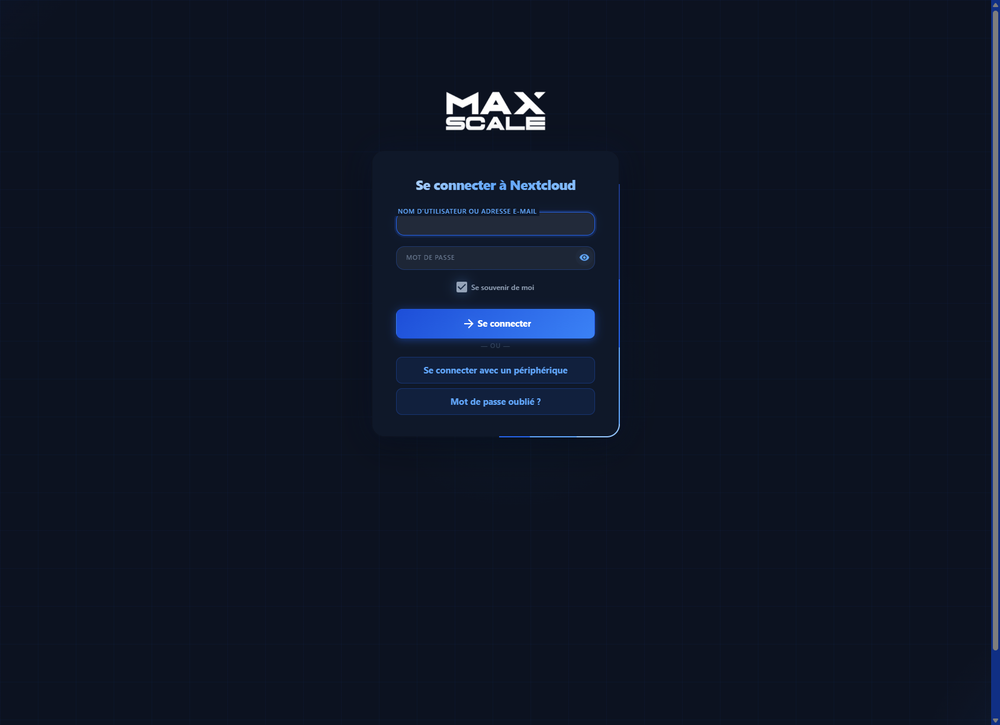
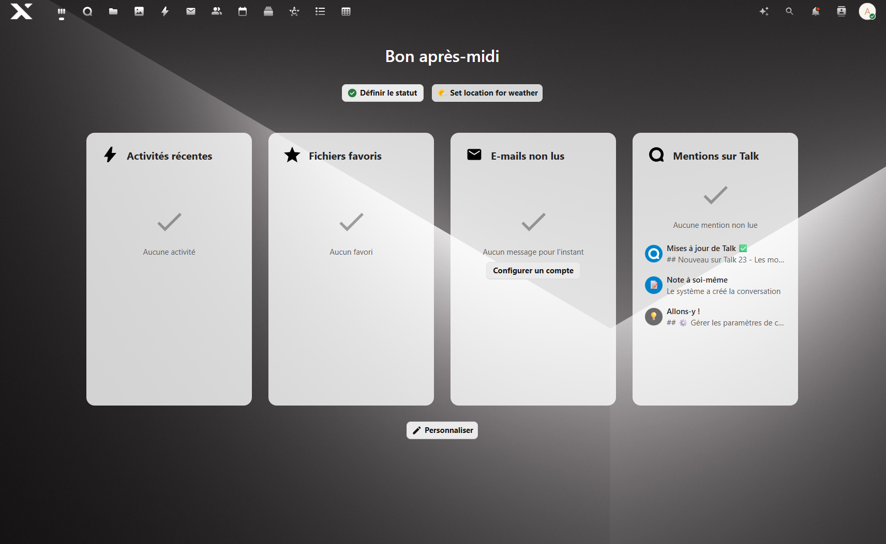
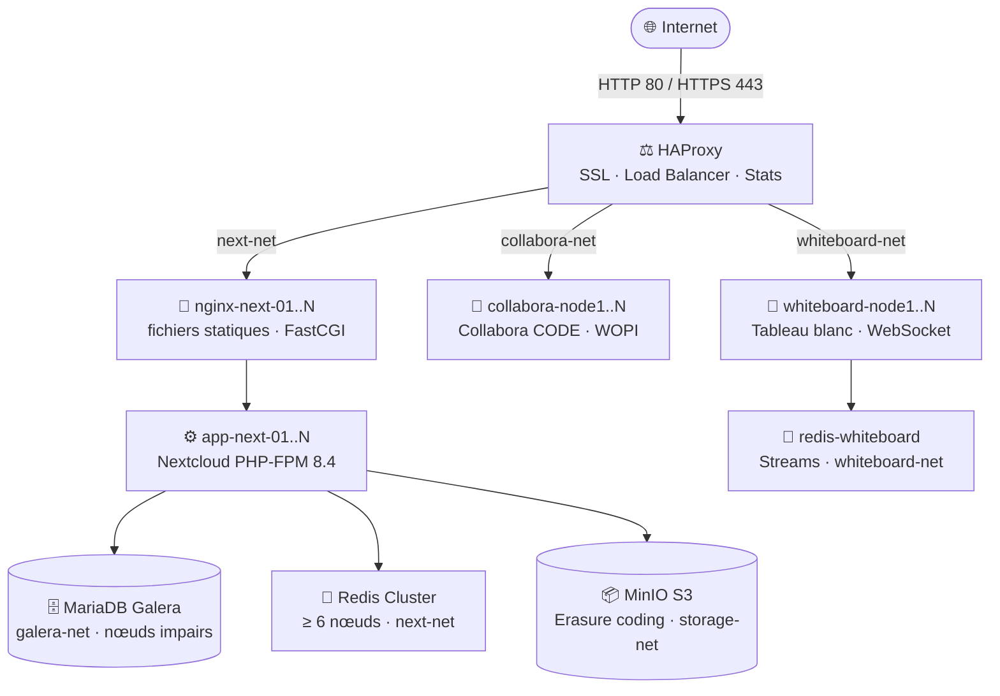

<div align="center">


**Infrastructure Nextcloud haute disponibilité — déployable en une commande**

[](https://github.com/oboeglen/Azure-NXT-Maxscale)
[](https://nextcloud.com)
[](https://www.php.net)
[](LICENSE)
[](https://github.com/oboeglen/Azure-NXT-Maxscale/commits/main)

[](https://docs.docker.com/compose/)
[](https://www.haproxy.org)
[](https://mariadb.com/kb/en/galera-cluster/)
[](https://redis.io/docs/management/scaling/)
[](https://min.io)
[](https://www.collaboraonline.com)

[](https://letsencrypt.org)
[](https://www.openssl.org)
[](https://hstspreload.org)
[](https://developer.mozilla.org/en-US/docs/Web/HTTP/CSP)
[](https://securityheaders.com)

*Debian · Ubuntu · RHEL · Rocky Linux · AlmaLinux — x86\_64*

</div>

---

<div align="center">
<table>
<tr>
<td align="center"><br/><sub>Page de connexion</sub></td>
<td align="center"><br/><sub>Tableau de bord</sub></td>
</tr>
</table>
</div>

---

<div align="center">


</div>

---

## Table des matières

- [🚀 Déploiement rapide](#-déploiement-rapide)
- [⚙️ Ce que fait deploy.sh](#️-ce-que-fait-deploysh)
- [🏗️ Architecture](#️-architecture)
- [📋 Prérequis](#-prérequis)
- [🧩 Services déployés](#-services-déployés)
- [🔧 Configuration Nextcloud](#-configuration-nextcloud)
- [🔄 Haute disponibilité](#-haute-disponibilité)
- [💾 Stockage objet MinIO](#-stockage-objet-minio)
- [🔒 Sécurité HAProxy](#-sécurité-haproxy)
- [📝 Collabora CODE](#-collabora-code)
- [📐 Scaling — ajout et suppression de nœuds](#-scaling--ajout-et-suppression-de-nœuds)
- [🛠️ Opérations courantes](#️-opérations-courantes)
- [🚢 Déploiement manuel](#-déploiement-manuel)
- [📊 Performances & dimensionnement](#-performances--dimensionnement)
- [🛡️ Recommandations sécurité réseau](#️-recommandations-sécurité-réseau)

---

## 🚀 Déploiement rapide

```bash
curl -fsSL https://raw.githubusercontent.com/oboeglen/Azure-NXT-Maxscale/main/deploy.sh \
  -o /tmp/deploy.sh && sudo bash /tmp/deploy.sh
```

Le script détecte votre OS, installe Docker si nécessaire, pose les questions essentielles et déploie l'infrastructure complète. La configuration est sauvegardée et réutilisable à chaque relance.

---

## ⚙️ Ce que fait `deploy.sh`

| Étape | Action |
|:-----:|--------|
| ① | Vérification RAM (≥ 16 Go), disque (≥ 50 Go), Docker ≥ 20 |
| ② | Détection OS et installation automatique de Docker + Compose |
| ③ | Clone du dépôt depuis GitHub |
| ④ | Questions interactives — domaines, nœuds, disques MinIO, certificats |
| ⑤ | Génération sécurisée de tous les secrets (aucun caractère `#`) |
| ⑥ | Génération du `.env`, `docker-compose.yml` et configs Galera |
| ⑦ | Vérification DNS + certificats SSL Let's Encrypt (HTTP-01 / TLS-ALPN-01) |
| ⑧ | Pull des images Docker en parallèle avec barre de progression |
| ⑨ | Déploiement avec suivi en temps réel et timeout adaptatif |
| ⑩ | Vérification de santé de tous les services + affichage des identifiants |

**Contraintes appliquées automatiquement**

| Composant | Contrainte | Raison |
|-----------|------------|--------|
| MariaDB Galera | Nombre de nœuds **impair** | Quorum Galera (évite le split-brain) |
| Redis Cluster | Nombre **pair ≥ 6** | Masters + réplicas (3+3 minimum) |
| MinIO | Tolérance calculée et affichée | Erasure coding EC:N/2 |
| Nextcloud | Attend que Galera soit SYNCED | Vérification WSREP via PDO PHP |

---

## 🏗️ Architecture



> [!NOTE]
> Seul HAProxy expose des ports vers l'extérieur (80 et 443). Tous les fichiers utilisateur sont stockés dans MinIO. La chute d'un nœud est **transparente** pour l'utilisateur final.

**Flux d'une requête :**
```
Client → HAProxy (SSL/TLS) → nginx-next-0X → app-next-0X (PHP-FPM :9000)
```

---

## 📋 Prérequis

| Composant | Requis |
|-----------|--------|
| Système d'exploitation | Debian 11/12/13 · Ubuntu 22.04/24.04 · RHEL / Rocky / AlmaLinux 8/9 |
| Architecture | x86\_64 |
| CPU | 8 cœurs minimum |
| RAM | 16 Go minimum (32 Go recommandés en production) |
| Disque | 500 Go SSD (selon l'usage et le nombre de nœuds) |
| DNS | 3 sous-domaines pointant vers ce serveur **avant** le lancement |
| Ports | 80 et 443 libres pour la validation des certificats |

> [!TIP]
> Docker et Docker Compose sont installés automatiquement s'ils sont absents.

---

## 🧩 Services déployés

| Service | Image | Rôle |
|---------|-------|------|
| `haproxy` | `haproxy:2.8-alpine` | Point d'entrée unique — reverse proxy, SSL, load balancing |
| `nginx-acme` | `nginx:1.27-alpine` | Validation des challenges ACME (Let's Encrypt) |
| `certbot` | `certbot/certbot` | Renouvellement SSL automatique toutes les 12h + healthcheck expiry 30 j |
| `nginx-next-01..N` | `nginx:1.27-alpine` | Fichiers statiques + proxy FastCGI vers PHP-FPM |
| `app-next-01..N` | `nextcloud:X.Y.Z-fpm` | Application Nextcloud (PHP-FPM) |
| `nextcloud-perms` | `nextcloud:X.Y.Z-fpm` | Correction des permissions volumes (one-shot) |
| `nextcloud-setup` | `nextcloud:X.Y.Z-fpm` | Auto-configuration post-installation (one-shot, protégé par sentinel) |
| `nextcloud-cron` | `nextcloud:X.Y.Z-fpm` | Tâches de fond — `cron.php` toutes les 5 min |
| `mariadb-node1..N` | `maxscale-mariadb-galera:11.4` | Base de données répliquée (Galera, bootstrap via `galera-bootstrap.sh`) |
| `galera-autoheal` | `willfarrell/autoheal` | Redémarrage automatique des nœuds Galera hors-sync — healthcheck `pgrep autoheal` |
| `redis-node1..N` | `redis:7.4-alpine` | Cache distribué (Redis Cluster) |
| `redis-cluster-init` | `redis:7.4-alpine` | Initialisation du cluster Redis (retry on-failure:5) |
| `minio-node1..N` | `minio/minio:latest` | Stockage objet S3 distribué (erasure coding) |
| `collabora-node1..N` | `collabora/code:latest` | Édition bureautique collaborative en ligne — healthcheck `/hosting/discovery` sur tous les nœuds |
| `whiteboard-node1..N` | `ghcr.io/nextcloud-releases/whiteboard:stable` | Tableau blanc collaboratif temps réel |
| `redis-whiteboard` | `redis:7.4-alpine` | État partagé du whiteboard (Redis Streams) |
| `minio-console` *(optionnel)* | `ghcr.io/georgmangold/console` | Console web MinIO — accessible via `/s3-console` |

> Le versioning du bucket MinIO est activé automatiquement par `deploy.sh` à la fin de l'installation Nextcloud, via `minio/mc:latest` (image tirée au déploiement mais sans container persistant).

**Ports exposés :** `80` (redirection HTTPS) · `443` (Nextcloud, Collabora, Whiteboard)

> [!CAUTION]
> Les stats HAProxy (`/stats`) et la console MinIO (`/s3-console`) sont des outils de diagnostic activables lors du déploiement. Les deux pages requièrent des identifiants, mais elles restent exposées sur l'URL publique de Nextcloud et révèlent des informations sensibles sur l'infrastructure. À réserver à un environnement de test ou à désactiver après usage.

---

## 🔧 Configuration Nextcloud

Tout est appliqué automatiquement par `nextcloud-setup` au premier démarrage.

### Intégrations

- **Redis Cluster** — cache distribué, sessions et verrouillage de fichiers
- **Collabora Online** — édition bureautique (Writer, Calc, Impress)
- **Whiteboard** — tableau blanc collaboratif temps réel
- **MinIO S3** — stockage objet pour tous les fichiers utilisateur
- `trusted_proxies` + `forwarded_for_headers` — IPs clients réelles remontées derrière HAProxy

### Sécurité & UX

- Mises à jour désactivées via l'interface web (`upgrade.disable-web = true`)
- Lien d'inscription masqué sur la page de connexion
- Dossier skeleton vide — aucun fichier exemple créé pour les nouveaux comptes
- `allow_local_remote_servers` et `overwriteprotocol` définis dans `nextcloud-custom.config.php`, monté en `:ro` dans tous les conteneurs — corrige `.well-known/caldav` et force HTTPS permanent

### Performance

- Cron système via `nextcloud-cron` — `cron.php` toutes les 5 minutes — healthcheck `/proc/1/cmdline`
- OPcache activé avec `validate_timestamps=0` (rechargement PHP requis pour prendre en compte les mises à jour de fichiers)
- Previews limitées à 2 048 px, formats légers uniquement (vidéo et Office désactivés)
- Rotation automatique des logs à 100 Mo
- `db:convert-filecache-bigint` appliqué en maintenance initiale

### Applications désactivées à l'installation

> `AppAPI` · `First Run Wizard` · `Nextcloud Announcements` · `Privacy` · `Support` · `Usage Survey` · `Related Resources` · `Recommendations`

---

## 🔄 Haute disponibilité

| Composant | Tolérance | Comportement lors d'une panne |
|-----------|:---------:|-------------------------------|
| 🔀 Nextcloud FPM | ✅ Automatique | Aucun impact — HAProxy redistribue en < 10 s |
| 🗄️ MariaDB Galera | ✅ Automatique | Aucun impact — quorum maintenu, `galera-autoheal` relance les nœuds hors-sync |
| 🔴 Redis Cluster | ✅ Automatique | Aucun impact — cluster tolère 1 panne par slot de hash |
| 📦 MinIO | ✅ Automatique | Lecture continue, écritures rétablies dès que le nœud revient |
| 📝 Collabora | ✅ Automatique | Session d'édition perdue, reconnexion automatique |
| 🎨 Whiteboard | ✅ Automatique | Reconnexion WebSocket automatique (état persisté dans Redis) |

### Redémarrage complet du cluster Galera

Le `galera-bootstrap.sh` détecte automatiquement le nœud à bootstrapper :

- **Premier démarrage** — pas de `grastate.dat` → bootstrap depuis node1
- **Arrêt propre** — `safe_to_bootstrap: 1` → bootstrap depuis le dernier nœud à s'être arrêté
- **Crash / redémarrage à chaud** — `safe_to_bootstrap: 0` → node1 rejoint le cluster existant sans créer un nouveau (évite le split-brain)

Pour forcer un bootstrap manuel après un arrêt brutal de tous les nœuds :
```bash
# Identifier le nœud le plus avancé (seqno le plus élevé)
for i in 1 2 3; do echo "node$i:"; docker run --rm -v maxscale_mariadb_n${i}_data:/data alpine grep -E "seqno|safe" /data/grastate.dat; done
# Corriger le safe_to_bootstrap sur ce nœud, puis redémarrer
```

---

## 💾 Stockage objet MinIO

MinIO fonctionne en **erasure coding distribué** — N nœuds × D drives par nœud.

| Configuration | Tolérance en lecture | Tolérance en écriture |
|---|---|---|
| 4 nœuds × 2 drives (8 drives total) | Perte de 4 drives | Perte de 3 drives |
| 4 nœuds × 4 drives (16 drives total) | Perte de 8 drives | Perte de 7 drives |

**Mode test (mono-serveur)** — tous les chemins sur le même disque physique (`/data/minio/...`). Option proposée automatiquement par `deploy.sh`. À utiliser uniquement en développement.

**Mode production** — chaque `DATA{N}` doit pointer vers un **disque physique distinct** pour que l'erasure coding soit réellement effectif.

### Inspection du cluster

```bash
source /opt/nxt-maxscale/.env
docker run --rm --network storage-net --entrypoint sh minio/mc -c "
  mc alias set r http://minio-node1:9000 ${MINIO_ACCESS_KEY} ${MINIO_SECRET_KEY} --quiet
  mc admin info r
"
```

### Réparation après panne d'un nœud

```bash
source /opt/nxt-maxscale/.env
docker run --rm --network storage-net --entrypoint sh minio/mc -c "
  mc alias set r http://minio-node1:9000 ${MINIO_ACCESS_KEY} ${MINIO_SECRET_KEY} --quiet
  mc admin heal -r r/nextcloud
"
```

### Console web MinIO (optionnelle)

> [!WARNING]
> La console est protégée par les identifiants MinIO (`MINIO_ACCESS_KEY` / `MINIO_SECRET_KEY`), mais elle est exposée sur l'URL publique de Nextcloud sans restriction d'IP ni couche réseau supplémentaire. Elle donne accès direct à tous les buckets MinIO. À utiliser uniquement en environnement de test ou de diagnostic, et à désactiver ensuite.

Activée lors du déploiement par `deploy.sh` (même principe que les stats HAProxy sur `/stats`). Une fois activée, la console est accessible depuis le navigateur sans exposer de port supplémentaire.

| | |
|---|---|
| **URL** | `https://<NEXTCLOUD_DOMAIN>/s3-console/login` |
| **Login** | Clé d'accès MinIO (`MINIO_ACCESS_KEY`) |
| **Mot de passe** | Clé secrète MinIO (`MINIO_SECRET_KEY`) |
| **Image** | [`ghcr.io/georgmangold/console`](https://github.com/georgmangold/console) |

HAProxy route `/s3-console/*` vers le container `minio-console:9090` en **strippant le préfixe** `/s3-console` avant de forwarder au serveur Go, ce qui évite les erreurs MIME sur les assets statiques du SPA React. La racine `/s3-console` et `/s3-console/` sont automatiquement redirigées vers `/s3-console/login`.

> [!TIP]
> Pour activer ou désactiver la console sur un déploiement existant, relancer `deploy.sh` — la réponse est sauvegardée dans le fichier de configuration et réutilisée à chaque relance.

---

## 🔒 Sécurité HAProxy

### Stats HAProxy (optionnelles)

> [!WARNING]
> Les stats (`/stats`) sont protégées par un mot de passe dédié (`HAPROXY_STATS_PASSWORD`), mais restent exposées sur l'URL publique de Nextcloud. Elles révèlent la topologie interne de l'infrastructure (noms des containers, états des backends, métriques réseau). À réserver à un environnement de test ou à désactiver après usage.

Activées lors du déploiement par `deploy.sh`. Accessibles à `https://<NEXTCLOUD_DOMAIN>/stats` avec les identifiants définis à l'installation (`HAPROXY_STATS_PASSWORD`).

### TLS

- TLS 1.2 minimum, **TLS 1.3 préféré**
- Suites modernes uniquement — ECDHE + AES-GCM + CHACHA20
- `no-tls-tickets` — confidentialité persistante (Perfect Forward Secrecy)

### En-têtes HTTP

| En-tête | Valeur |
|---------|--------|
| `Strict-Transport-Security` | 2 ans · `includeSubDomains` · `preload` |
| `X-Content-Type-Options` | `nosniff` |
| `X-XSS-Protection` | `1; mode=block` |
| `Referrer-Policy` | `strict-origin-when-cross-origin` |
| `X-Frame-Options` | `SAMEORIGIN` (Nextcloud uniquement) |
| `Permissions-Policy` | `camera=(self)` · `microphone=(self)` · `geolocation=(self)` · `payment=()` |
| `Server`, `X-Powered-By` | Supprimés |

> `camera`, `microphone` et `geolocation` sont autorisés sur `(self)` pour Nextcloud Talk et les applications de géolocalisation.

### Filtrage des requêtes

- **Anti-Slowloris** — abandon de requête si non reçue en entier en 10 s
- **Méthodes dangereuses** bloquées — `TRACE`, `DEBUG`, `CONNECT`
- **Méthodes WebDAV** restreintes aux chemins API (`/remote.php`, `/public.php`, `/ocs`) — `OPTIONS` libre pour les preflight CORS
- **User-agents scanners** bloqués — sqlmap, nikto, nmap, masscan, zgrab
- **Paths de scan courants** bloqués (403) — `/wp-admin`, `/wp-login`, `/.git`, `/.env`, `/phpmyadmin`, `/xmlrpc.php`, `/cgi-bin`…
- **Console admin Collabora** bloquée (403) — `/browser/dist/admin` inaccessible depuis l'extérieur
- **Logs health checks silencés** — `/status.php`, `/robots.txt`, `/favicon.ico` n'apparaissent pas dans les logs HAProxy (~80 % de réduction du bruit)
- **CSP étendue** — WebSocket autorisé vers Collabora et Whiteboard (`wss://`)

### Supervision (page `/stats`)

La page de statistiques HAProxy affiche l'état en temps réel de **tous** les backends :

| Bloc | Contenu |
|------|---------|
| `nextcloud` | Nœuds nginx-next-01..N (HTTP :80) |
| `nextcloud-fpm` | Nœuds app-next-01..N (FPM TCP :9000) — monitoring uniquement |
| `coolwsd` | Nœuds Collabora (WOPI :9980) |
| `whiteboard` | Nœuds Whiteboard (WS :3002) |
| `galera` | Nœuds MariaDB (:3306) |
| `minio` | Nœuds MinIO S3 (:9000) |
| `redis-cluster` | Nœuds Redis (:6379) |

---

## 📝 Collabora CODE

### Mode home_mode — limite supprimée

Collabora est déployé en **`home_mode`** (`--o:home_mode.enable=true`), ce qui désactive l'écran de démarrage et le popup de feedback utilisateur.

Par défaut, `home_mode` plafonne chaque nœud à 20 connexions et 10 documents simultanés. **`deploy.sh` supprime automatiquement cette limite** via un patch binaire du processus `coolwsd` appliqué après le démarrage des containers. Le binaire est remplacé sur le disque du container (`docker cp` + `docker restart`) — `extra_params` et la configuration YAML ne sont pas touchés.

| Nœuds | Connexions | Documents |
|:-----:|:----------:|:---------:|
| 1 | ∞ | ∞ |
| N | ∞ | ∞ |

Le patch tente trois stratégies dans l'ordre : ① séquence d'octets exacte connue, ② paire `mov r32,20 + mov r32,10` suivie d'un `TEST`/`CMP` dans les 24 octets suivants (tous les registres x86-64 testés), ③ ancrage sur la chaîne `home_mode.enable` pour localiser le code adjacent. Les deux immédiats trouvés sont remplacés par `INT_MAX (2 147 483 647)`. Si aucune stratégie ne correspond, le patch est ignoré avec un avertissement — la stack reste fonctionnelle avec les limites d'origine.

### Persistance du patch après redémarrage

Le patch est écrit dans la couche d'écriture du container (`docker cp`). Son comportement selon le scénario :

| Scénario | Patch conservé ? |
|---|:---:|
| Crash + redémarrage automatique (`restart: always`) | ✅ |
| `docker restart collabora-nodeX` | ✅ |
| `docker compose up -d` (container inchangé) | ✅ |
| Mise à jour via `deploy.sh` (mode mise à jour rapide) | ✅ |
| `docker compose up -d --force-recreate` | ❌ |
| `docker compose down` + `docker compose up -d` | ❌ |
| Mise à jour manuelle (`docker pull` + `docker compose up -d` hors `deploy.sh`) | ❌ |

`deploy.sh` réapplique le patch automatiquement dans tous les cas : déploiement initial et mode mise à jour rapide (pull + recreate des images). Un `docker compose up -d` manuel hors `deploy.sh` restaure le binaire d'origine sans avertissement.

### Sécurité

- **Console d'administration** (`/browser/dist/admin/admin.html`) bloquée par HAProxy → HTTP 403
- **Limite de taille de document** — 100 Mo maximum par document ouvert (`--o:net.max_file_size=104857600`), configurable dans `extra_params`
- **SSL terminé par HAProxy** — Collabora reçoit du HTTP en interne (`ssl.enable=false`, `ssl.termination=true`)

---

## 📐 Scaling — ajout et suppression de nœuds

Lorsqu'une stack est déjà déployée, relancer `deploy.sh` propose un menu en trois options :

```
[1] Mise à jour rapide       — pull des images + redémarrage
[2] Augmenter / réduire les nœuds
[3] Déploiement complet      — repart de zéro
```

Le mode **scaling** modifie le nombre de nœuds de chaque service **sans perte de données** — les volumes Docker ne sont jamais supprimés, le `.env` n'est pas régénéré.

### Comportement par service

| Service | Scale-up | Scale-down | Notes |
|---------|:--------:|:----------:|-------|
| **Nextcloud FPM + nginx** | ✅ | ✅ | Paires FPM+nginx ajoutées ou retirées ensemble |
| **MariaDB Galera** | ✅ | ✅ | Nombre impair requis — SST automatique à l'ajout |
| **Redis Cluster** | ✅ | ✅ | Delta pair obligatoire — intégration cluster automatique |
| **Collabora CODE** | ✅ | ✅ | Patch binaire `home_mode` réappliqué sur les nouveaux nœuds |
| **Whiteboard** | ✅ | ✅ | |
| **MinIO** | ✅ | ❌ | Scale-up par expansion de pool ; scale-down via `mc admin decommission` |

### Mécanique interne

**Nextcloud / Galera / Collabora / Whiteboard** — `docker compose up -d --remove-orphans` crée les nouveaux containers et retire les orphelins. HAProxy est redémarré pour prendre en compte les nouveaux backends.

**Redis Cluster (scale-up)**
1. Attente que les nouveaux nœuds répondent à `PING`
2. `--cluster add-node` pour chaque master
3. `cluster myid` pour récupérer l'ID du master, puis `--cluster add-node --cluster-slave` pour la réplica
4. `--cluster fix` pour résoudre les éventuels slots en migration ouverte
5. `--cluster rebalance --cluster-use-empty-masters` pour égaliser les slots

**Redis Cluster (scale-down)**
1. Les slots du master à retirer sont reshardés vers un autre master (`--cluster reshard`)
2. `--cluster del-node` pour la réplica puis le master
3. `--cluster fix` + `--cluster rebalance` pour rééquilibrer les slots restants

**MinIO (scale-up)**
- Les chemins des nouveaux nœuds sont collectés interactivement (défaut : `/data/minio/nodeN/dataN`)
- Le nouveau pool est enregistré dans `.minio-pools` (`start:end` par ligne)
- `gen_compose` reconstruit la commande `server` avec tous les pools : `server pool1 pool2 ...`
- Tous les nœuds MinIO redémarrent avec la nouvelle commande (~30 s d'indisponibilité, données préservées)

### Contraintes

| Contrainte | Détail |
|-----------|--------|
| Redis — delta pair | Chaque lot = 1 master + 1 réplica |
| Redis — minimum 6 | 3 masters + 3 réplicas minimum |
| Galera — nombre impair | Quorum requis |
| MinIO — scale-down | Non supporté — décommissionnement via `mc admin decommission start` |
| Mots de passe | Jamais régénérés lors du scaling — le `.env` est préservé |

### Persistance entre reboots

La configuration de scaling est stockée dans :

| Fichier | Contenu | Persistance |
|---------|---------|:-----------:|
| `.env` | Mots de passe, chemins MinIO, MINIO_MODE, MINIO_BYPASS | ✅ Permanent |
| `.minio-pools` | Historique des pools MinIO | ✅ Permanent |
| `/tmp/.nxt-maxscale-config.env` | Cache réponses deploy.sh | ❌ Perdu au reboot |

Si le cache `/tmp/` est absent, `deploy.sh` reconstruit automatiquement la configuration depuis `.env` et l'état des containers en cours.

---

## 🛠️ Opérations courantes

### Vérifier l'état du cluster Galera

```bash
source /opt/nxt-maxscale/.env
docker exec mariadb-node1 mariadb -uroot -p"${MARIADB_ROOT_PASSWORD}" \
  -e "SHOW GLOBAL STATUS LIKE 'wsrep_%';" 2>/dev/null \
  | grep -E 'cluster_size|cluster_status|ready|connected|state_comment|flow_control_paused'
```

### Bootstrap Galera après panne totale

```bash
# 1. Démarrer le nœud bootstrap
docker compose up -d mariadb-node1

# 2. Une fois node1 healthy, démarrer les autres en parallèle (IST/SST automatique)
docker compose up -d mariadb-node2 mariadb-node3 # ... jusqu'à mariadb-nodeN
```

> Après synchronisation complète, éditer `mariadb/galera-node1.cnf` et remplacer `gcomm://` par `gcomm://mariadb-node1,mariadb-node2,...,mariadb-nodeN`, puis relancer node1.

### Renouvellement SSL

Le certificat est renouvelé automatiquement par `certbot` toutes les 12h. Pour forcer manuellement :

```bash
docker compose exec certbot certbot renew --webroot -w /var/www/certbot
docker compose restart haproxy
```

### Relancer la configuration post-installation

```bash
docker compose rm -f nextcloud-setup && docker compose up -d nextcloud-setup
```

### Vérifier les logs Nextcloud

```bash
docker exec -u www-data app-next-01 php /var/www/html/occ log:tail --lines=50
```

---

## 🚢 Déploiement manuel

<details>
<summary>Voir les étapes détaillées</summary>

### 1. Cloner le dépôt

```bash
git clone https://github.com/oboeglen/Azure-NXT-Maxscale.git
cd Azure-NXT-Maxscale
```

### 2. Configurer l'environnement

```bash
cp .env.example .env
nano .env   # Remplir TOUTES les valeurs
```

### 3. Générer les certificats SSL

> Le DNS doit pointer vers ce serveur avant cette étape.

```bash
source .env
docker run --rm -p 80:80 \
  -v "maxscale_letsencrypt:/etc/letsencrypt" \
  certbot/certbot certonly --standalone --agree-tos --no-eff-email \
  --email "${CERTBOT_EMAIL}" \
  -d "${NEXTCLOUD_DOMAIN}" -d "${COLLABORA_DOMAIN}" -d "${WHITEBOARD_DOMAIN}" \
  --cert-name stack

mkdir -p certs
docker run --rm \
  -v "maxscale_letsencrypt:/etc/letsencrypt:ro" \
  -v "$(pwd)/certs:/certs" \
  alpine sh -c "cat /etc/letsencrypt/live/stack/fullchain.pem \
    /etc/letsencrypt/live/stack/privkey.pem > /certs/stack.pem && chmod 600 /certs/stack.pem"
```

### 4. Créer les répertoires MinIO

```bash
for node in 1 2 3 4; do
  for disk in 1 2 3 4; do
    path=$(grep "^MINIO_NODE${node}_DATA${disk}=" .env | cut -d= -f2)
    mkdir -p "${path}"
  done
done
```

### 5. Démarrer l'infrastructure

```bash
docker compose up -d
docker compose logs -f nextcloud-setup
```

</details>

---

## 📊 Performances & dimensionnement

> Benchmarks réalisés sur une instance de référence — **6 nœuds FPM, 5 Galera, 6 Redis, MinIO 4×2 drives, 3 Collabora, 3 Whiteboard** — depuis un client externe.

### Résultats mesurés

| Endpoint | Concurrence | Débit | Moyenne | P95 | P99 | Erreurs |
|---|:-:|:-:|:-:|:-:|:-:|:-:|
| `/status.php` | 20 | **120 req/s** | 156 ms | 365 ms | 388 ms | 0 / 200 |
| `/login` | 20 | **44 req/s** | 432 ms | 697 ms | 862 ms | 0 / 200 |
| `/status.php` stress | 50 | **247 req/s** | 192 ms | 299 ms | 375 ms | 0 / 500 |
| `/status.php` stress | 100 | **242 req/s** | 369 ms | 494 ms | 522 ms | 0 / 500 |
| `/login` stress | 50 | **60 req/s** | 783 ms | 1 061 ms | 1 154 ms | 0 / 300 |
| Stress maximum | 150 | **231 req/s** | 580 ms | 959 ms | 1 059 ms | 0 / 600 |

**0 erreur réseau** sur 1 900 requêtes. Le système tient à 150 connexions simultanées sans défaillance.

---

### Test de charge grandeur nature — PME 500 utilisateurs quotidiens

> Test réalisé sur la configuration de référence **6 FPM · 5 Galera · 6 Redis · 4 MinIO · 3 Collabora · 3 Whiteboard** sur un VPS 7,6 Go RAM (sous-dimensionné vs. production recommandée — 32 Go). k6 v0.55 lancé **depuis le serveur lui-même** : la latence réseau TLS est quasi nulle ; en usage réel, ajouter ~50–150 ms par requête selon la géographie du client.

#### Protocole

| Paramètre | Valeur |
|-----------|--------|
| Outil | [k6](https://k6.io) v0.55 |
| Durée | 1 min ramp-up · 6 min charge soutenue · 1 min ramp-down |
| VUs peak | **34** |
| Comptes de test | 25 (`pme_user_01..25`) en rotation parmi les VUs |
| Itérations complètes | 980 en 8m30s |
| Requêtes HTTP totales | 3 911 — 7,68 req/s moyen |

> **Pourquoi 34 VUs représentent ~500 utilisateurs quotidiens**
>
> Un VU (Virtual User) simule une **session concurrente** avec des temps de réflexion réalistes (10–30 s entre requêtes), ce qui reproduit le comportement d'un humain. 500 DAU (Daily Active Users) ne sont jamais tous connectés simultanément : en pratique, le pic de concurrence dans une PME représente 5–10 % des DAU, soit ~35–50 sessions actives au même moment. Le ratio ici est **1 VU : ~15 DAU**.
>
> Les **25 comptes** ne limitent pas la représentativité : la charge serveur (PHP-FPM, Galera, Redis, MinIO) est déterminée par le nombre de **requêtes concurrentes**, pas par le nombre de comptes distincts en base. Chaque VU pioche un compte au hasard dans le pool ; plusieurs VUs peuvent utiliser le même compte simultanément, ce qui est plus agressif sur les verrous de fichiers Nextcloud qu'en usage réel — les résultats sont donc conservateurs.

**Scénarios simulés**

| Scénario | VUs | Comportement |
|----------|:---:|--------------|
| Sync client WebDAV desktop | 20 | `PROPFIND` · `GET` · `PUT` txt · `PUT` binaire — intervalle 10–30 s |
| Sessions navigateur | 8 | Login CSRF · Dashboard · Files app · OCS Activity · Upload |
| Éditeurs Collabora | 4 | WOPI discovery · config richdocuments · upload .odt · save |
| Utilisateurs Whiteboard | 2 | Création `.whiteboard` · lecture · session 20–50 s |

#### Résultats

| Scénario | avg | p(50) | p(90) | **p(95)** | p(99) | SLA | Statut |
|---|---:|---:|---:|---:|---:|:---:|:---:|
| Sessions navigateur | 74 ms | 68 ms | 123 ms | **155 ms** | 243 ms | < 4 s | ✅ |
| Sync WebDAV | 862 ms | 689 ms | 1 680 ms | **1 980 ms** | 2 660 ms | < 3 s | ✅ |
| Collabora WOPI | 959 ms | 864 ms | 1 920 ms | **2 160 ms** | 3 010 ms | < 5 s | ✅ |
| Whiteboard | 904 ms | 930 ms | 1 770 ms | **2 060 ms** | 2 720 ms | < 5 s | ✅ |
| **Login** (p.m.) | 167 ms | 149 ms | 244 ms | 303 ms | 444 ms | — | — |
| **Upload fichier** (p.m.) | 449 ms | 392 ms | 694 ms | 764 ms | 1 070 ms | — | — |

**Fiabilité pendant le test**

| Métrique | Valeur |
|----------|--------|
| Erreurs HTTP 5xx | **0** |
| Crashs de conteneurs | **0** |
| `http_req_failed` (timeouts + resets TLS) | 0,97 % (38 / 3 911) |
| Données reçues | 45 MB · 88 kB/s |
| Données envoyées | 3,4 MB · 6,6 kB/s |

**Tous les seuils de performance passent.** La configuration 6 FPM tient le pic PME sans erreur serveur ni crash, y compris sur un VPS limité à 7,6 Go RAM.

---

### Simulation par nombre de nœuds FPM

> Modèle basé sur les mesures réelles. Rendement décroissant de **88 % par nœud** dû aux ressources partagées (DB, Redis, HAProxy). Avec 5 nœuds Galera (~2 500 TPS en écriture), le goulot DB n'est atteint qu'à partir de **14 nœuds FPM**.

| Nœuds FPM | req/s PHP | req/s léger | Concurrent | Actifs | Total users | P99 PHP | RAM min |
|:---------:|:---------:|:-----------:|:----------:|:------:|:-----------:|:-------:|:-------:|
| 1 | ~10 | ~41 | ~9 | ~55 | ~550 | 3 381 ms | 16 Go |
| 2 | ~18 | ~77 | ~17 | ~103 | ~1 030 | 2 230 ms | 19 Go |
| 3 | ~26 | ~109 | ~24 | ~145 | ~1 450 | 1 749 ms | 22 Go |
| **6** ★ | **~44** | **~183** | **~40** | **~245** | **~2 450** | **1 154 ms** | **31 Go** |
| 9 | ~56 | ~234 | ~52 | ~313 | ~3 130 | 904 ms | 40 Go |
| 12 | ~65 | ~269 | ~59 | ~359 | ~3 590 | 761 ms | 49 Go |
| 15 | ~70 | ~291 | ~64 | ~389 | ~3 890 | 665 ms | 58 Go |
| 20 | ~73 | ~303 | ~67 | ~405 | ~4 050 | 560 ms | 73 Go |

> **★** Configuration de référence mesurée en conditions réelles  
> **Actifs** = concurrent × 6 (fenêtre de session de 5 min) · **Total users** = actifs × 10 (10 % connectés au pic)  
> **RAM min** = 3 Go/nœud FPM + 13 Go overhead (5 Galera · 6 Redis · 4 MinIO · 3 Collabora · 3 Whiteboard · HAProxy)

---

### Consommation des ressources par composant

| Composant | RAM typique | CPU idle | CPU charge | Réseau |
|-----------|:-----------:|:--------:|:----------:|--------|
| HAProxy | ~50 Mo | < 1 % | 5–15 % | Tout le trafic entrant/sortant |
| nginx (par nœud) | ~30 Mo | < 1 % | 2–5 % | Fichiers statiques + proxy FastCGI |
| Nextcloud FPM (par nœud) | 500 Mo – 1 Go | 5 % | 30–60 % | Interne :9000 |
| MariaDB Galera (par nœud) | 1–2 Go | 5 % | 20–40 % | IST/SST replication |
| Redis (par nœud) | 50–200 Mo | < 1 % | 2–5 % | Cluster gossip + keyspace |
| MinIO (par nœud) | 256–512 Mo | < 1 % | 10–30 % | Erasure coding inter-nœuds |
| Collabora CODE (par nœud) | 500 Mo – 1 Go | 2 % | 40–80 % | WOPI + WebSocket |
| Whiteboard (par nœud) | ~100 Mo | < 1 % | 5–10 % | WebSocket temps réel |
| galera-autoheal | ~20 Mo | < 1 % | < 1 % | Docker socket local |

---

### Recommandations par profil d'usage

| Profil | FPM | DB Galera | Redis | RAM serveur | Utilisateurs |
|--------|:---:|:---------:|:-----:|:-----------:|:------------:|
| 🧪 Test / dev | 1–2 | 1 | 0 (APCu) | 8–16 Go | < 100 |
| 🏢 Petite équipe | 3 | 3 | 6 | 22–28 Go | ~1 500 |
| 🏭 PME ★ | 6 | 5 | 6 | 32–40 Go | ~2 500 |
| 🏦 Entreprise | 9–12 | 5–7 | 6–8 | 48–64 Go | 3 000–3 600 |
| 🏛️ Grande organisation | 15–20 | 7 | 8 | 64–80 Go | ~4 000 |

---

## 🛡️ Recommandations sécurité réseau

Une fois l'infrastructure déployée, **restreindre les ports exposés** est la première mesure à appliquer. Par défaut, toutes les interfaces sont ouvertes — seuls trois ports sont nécessaires pour les utilisateurs finaux.

### Ports à autoriser

| Port | Protocole | Usage |
|------|-----------|-------|
| `80` | TCP | Redirection HTTP → HTTPS + challenge ACME Let's Encrypt |
| `443` | TCP | HTTPS — point d'entrée principal (Nextcloud, Collabora, Whiteboard) |
| `22` | TCP | SSH administration (restreindre à votre IP si possible) |

> Tous les autres ports (3306 MariaDB, 6379 Redis, 9000 MinIO, 9980 Collabora…) sont internes aux réseaux Docker et ne doivent **jamais** être exposés sur l'interface publique.

Les deux approches complémentaires recommandées : un **firewall UFW** pour filtrer le trafic entrant, et **fail2ban** pour bloquer les tentatives d'intrusion SSH.

### Option 1 — Firewall UFW (recommandé)

```bash
# Installer UFW si absent
sudo apt install ufw -y

# Politique par défaut : tout bloquer en entrée
sudo ufw default deny incoming
sudo ufw default allow outgoing

# Autoriser uniquement les ports nécessaires
sudo ufw allow 22/tcp    # SSH
sudo ufw allow 80/tcp    # HTTP (ACME + redirection)
sudo ufw allow 443/tcp   # HTTPS

# Activer (la connexion SSH active reste ouverte)
sudo ufw enable
sudo ufw status verbose
```

> **Pour restreindre SSH à une IP fixe** (recommandé en production) :
> ```bash
> sudo ufw delete allow 22/tcp
> sudo ufw allow from <VOTRE_IP> to any port 22
> ```

### Option 2 — Fail2ban (protection brute-force SSH)

Fail2ban surveille les logs SSH et bannit automatiquement les IPs après plusieurs tentatives échouées. Complémentaire au firewall UFW.

```bash
sudo apt install fail2ban -y

# Configuration recommandée
sudo tee /etc/fail2ban/jail.d/sshd.local << 'EOF'
[sshd]
enabled  = true
port     = ssh
maxretry = 5
findtime = 600
bantime  = 3600
EOF

sudo systemctl enable fail2ban
sudo systemctl restart fail2ban

# Vérifier les IPs bannies
sudo fail2ban-client status sshd
```

---

## Support

**Dépôt :** [github.com/oboeglen/Azure-NXT-Maxscale](https://github.com/oboeglen/Azure-NXT-Maxscale)
